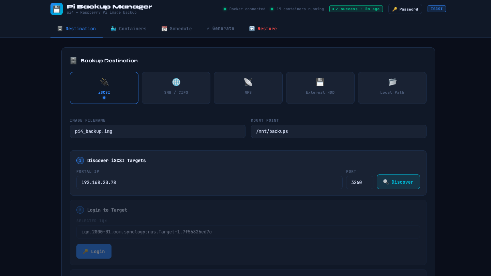
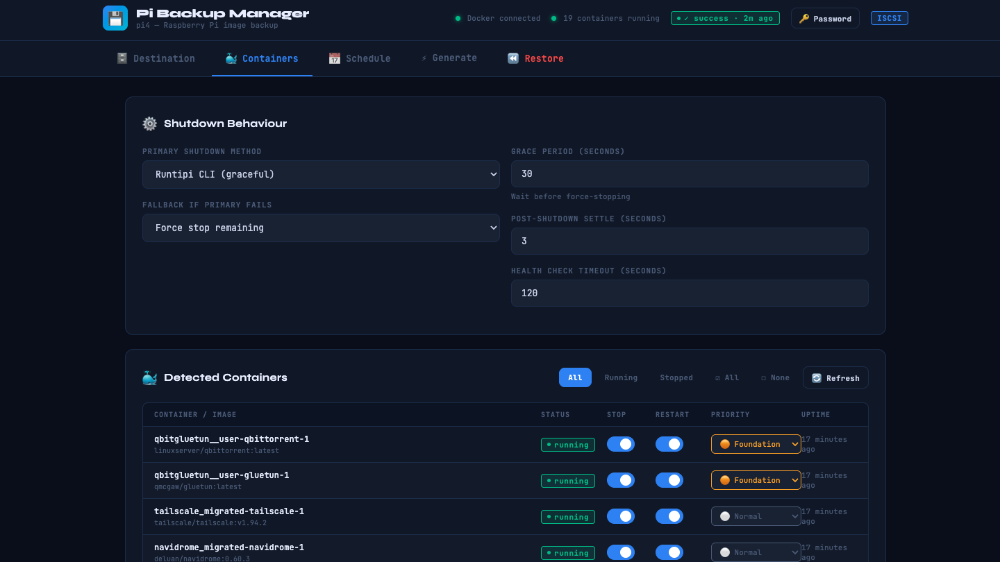
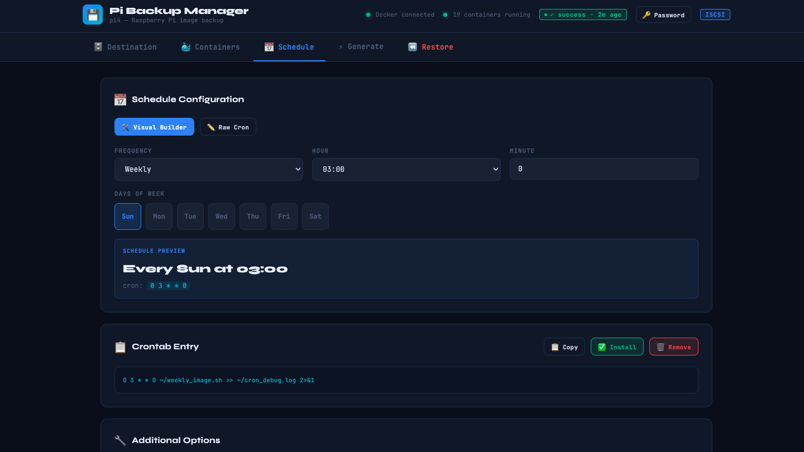
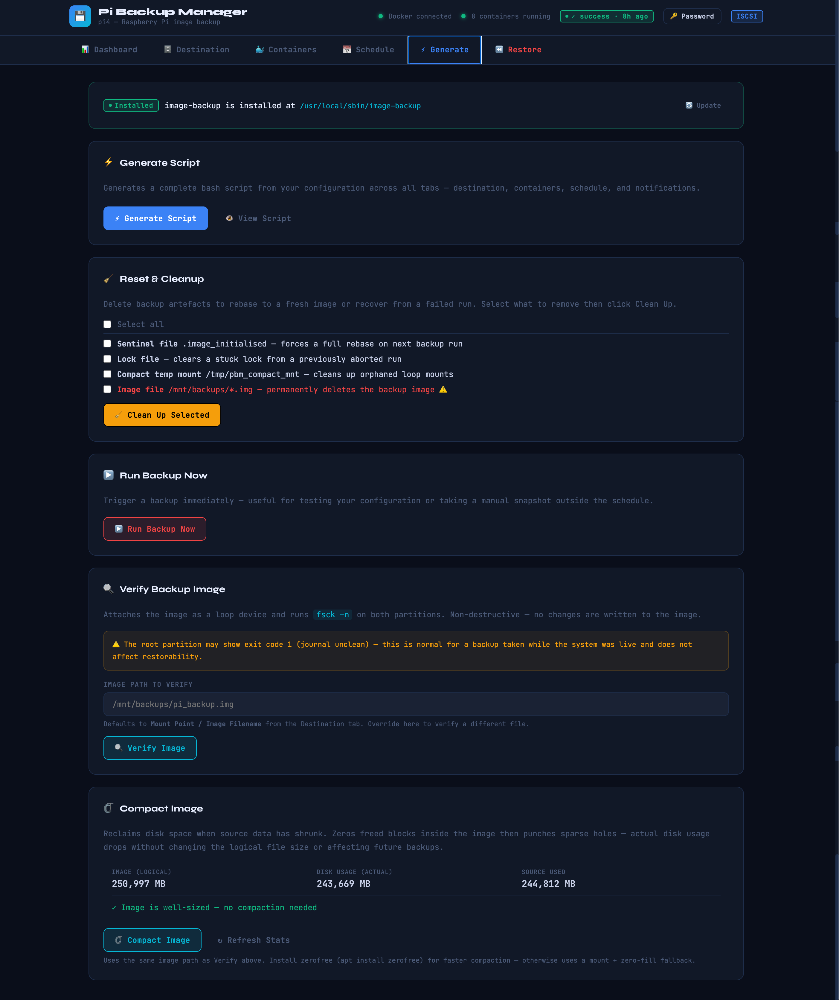
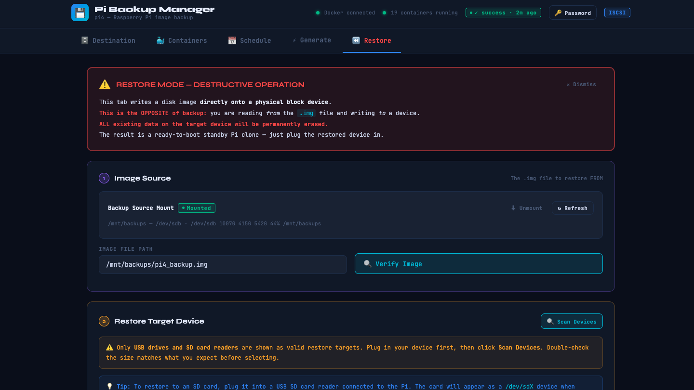

# Pi Backup Manager

A web-based Raspberry Pi image backup manager for Runtipi + Raspbian setups.



---

## What is this?

Pi Backup Manager is a self-hosted web UI that automates full SD card / boot disk image backups of your Raspberry Pi using [RonR's image-backup tools](https://github.com/seamusdemora/RonR-RPi-image-utils). It's the backup GUI that Runtipi doesn't have built-in.

You configure your backup destination, schedule, and notification settings through the browser. The app generates and installs a shell script that runs on cron — stopping your containers, backing up the image incrementally, restarting everything, and notifying you when done.

> Tested on Raspberry Pi OS (64-bit). May work on other Debian-based ARM systems.

---

## Features

- Full Pi image backup via RonR image-backup (incremental after first run)
- Multi-destination support: iSCSI, USB, SMB, NFS
- Secondary destinations via rsync after primary backup
- Runtipi-aware: stops and restarts Docker containers in the correct order
- Runtipi API fallback: restarts app containers that need network recreation
- Guided image-backup install from GitHub (no manual steps)
- Restore tab with USB/SD safety checks
- Visual cron scheduler
- ntfy.sh push notifications (start, success, failure)
- fstab mount-on-boot toggles
- Basic auth with first-run setup wizard
- 100% self-contained single Python file

---

## Requirements

- Raspberry Pi running Raspberry Pi OS (64-bit recommended)
- Python 3.9+
- Flask (`sudo apt install python3-flask`)
- `sudo` access for the running user
- [RonR image-backup tools](https://github.com/seamusdemora/RonR-RPi-image-utils) — installable via the GUI
- **Optional:** `zerofree` (`sudo apt install zerofree`) — for fast Compact Image; falls back to slower dd method without it
- **Optional:** Runtipi, SMB/NFS/iSCSI target, [ntfy.sh](https://ntfy.sh) account

---

## Installation

```bash
git clone https://github.com/jhutcho-svg/pi-backup-manager.git
cd pi-backup-manager
bash install.sh
```

The installer will:
- Copy `server.py` and set up the working directory
- Install Flask if not already present
- Install RonR image-backup tools from GitHub if not found
- Check Docker group membership
- Write, enable, and start the systemd service

Once complete, open your browser at `http://<pi-ip>:7823`.

### Custom port

```bash
PBM_PORT=8080 bash install.sh
```

---

## First Run

1. Open `http://<pi-ip>:7823` — you'll be prompted to set a username and password
2. Go to the **Destination** tab and configure where backups are stored
3. Go to the **Config** tab and set your image filename and optional ntfy topic
4. Go to the **Generate** tab, generate the script, and click **Install Script**
5. Go to the **Schedule** tab to set your cron schedule

---

## Usage

### Backup destinations

| Type | Notes |
|---|---|
| Local path | USB drive, NFS mount already in fstab |
| iSCSI | Auto-detects sessions; manages login/logout |
| SMB | Mounts share, runs backup, unmounts |
| NFS | Mounts share, runs backup, unmounts |

### How incremental backups work

`image-backup` requires the `-i` flag on the **first run only** to initialise the image file. After that, runs are incremental (much faster).

Pi Backup Manager tracks this automatically via a sentinel file (`$BACKUP_ROOT/.image_initialised`):
- Sentinel **absent** → first run, full image created
- Sentinel **present** → incremental update

The sentinel is only created on a successful backup, so a failed first run retries correctly.

> **Note:** If you rename the image file after the first run, delete the sentinel file to force re-initialisation.

### Runtipi container restart

When Runtipi is configured, the generated script:
1. Stops all running Docker containers before backup
2. After backup, starts containers using a three-tier fallback:
   - `docker start`
   - `docker compose up -d`
   - Runtipi REST API (for app containers that need network recreation, e.g. Immich, qbitgluetun)

Enter your Runtipi URL, username, and password in the **Config** tab to enable the API fallback.

---

## Configuration

All settings are saved in `~/pi-backup-manager/config.json`. The main options are set through the UI tabs — no manual file editing needed.

Key config options:

| Setting | Where | Description |
|---|---|---|
| Image filename | Config tab | e.g. `pi_backup.img` |
| Backup root | Config tab | Mount point for backup destination |
| ntfy topic | Config tab | Push notification topic |
| Runtipi directory | Config tab | Path to runtipi install (default `~/runtipi`) |
| Runtipi URL/credentials | Config tab | For API-based container restart |
| Cron schedule | Schedule tab | Visual picker or manual cron expression |

---

## Screenshots

| Destination | Containers |
|---|---|
|  |  |

| Schedule | Generate |
|---|---|
|  |  |

| Restore | |
|---|---|
|  | |

---

## Credits

- [RonR / seamusdemora](https://github.com/seamusdemora/RonR-RPi-image-utils) — image-backup and image-restore tools
- [Runtipi](https://runtipi.io) — the Docker platform this tool is designed around
- [ntfy.sh](https://ntfy.sh) — push notifications

---

## License

MIT — see [LICENSE](LICENSE)
